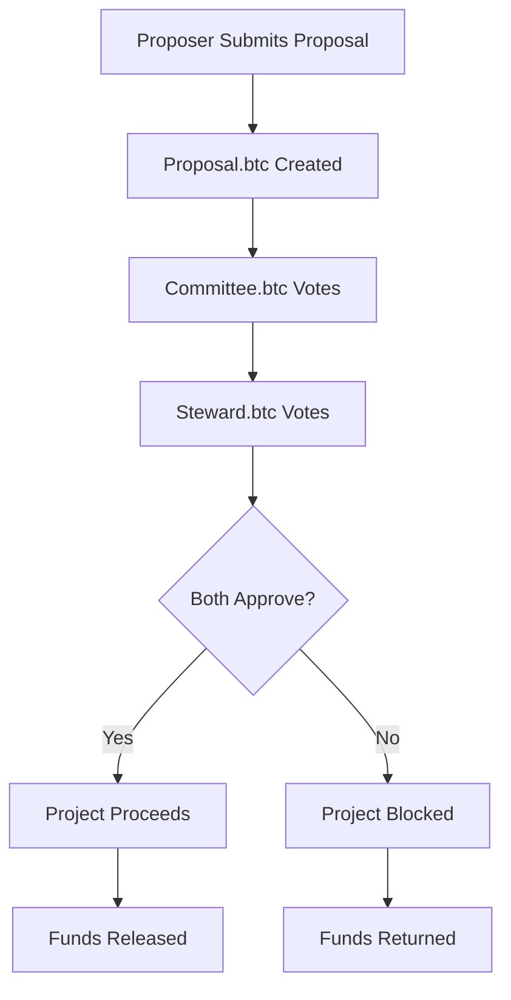

# Fiscal Policy 3.0: Decentralized Proposal Management System

A blockchain-based governance system for managing project proposals with dual-approval mechanisms and transparent fund tracking.

## Overview

This system implements an "Event of events" architecture where multiple entities interact to evaluate, approve, and monitor project proposals. The success of proposals is measured through transparent fund growth tracking and public oversight.

## Core Entities

### 🚀 **Proposer.btc**
- Submits project proposals for funding consideration
- Creates detailed project submissions with comprehensive information
- Manages project execution and fund utilization

### 📋 **Proposal.btc**
- Represents individual project proposals in the system
- Holds funds associated with project success
- Provides public visibility into project progress via North Star metrics

### 🏛️ **Committee.btc**
- Primary governance entity for proposal evaluation
- Votes Yes/No on submitted proposals
- Ensures proposals meet established criteria

### 🛡️ **Steward.btc**
- Secondary governance entity for proposal oversight
- Provides additional validation layer
- Votes Yes/No on proposals after committee review

## Proposal Submission Process

### Required Information
Every proposal submission must include a JSON payload with the following fields:

| Field | Description |
|-------|-------------|
| **Timestamp** | Submission date and time |
| **Title** | Project name |
| **Subtitle** | Brief project description |
| **Description** | Detailed project overview |
| **Problem Worth Solving** | Clear problem statement |
| **Github** | Repository link |
| **YouTube Demo Video** | Project demonstration |
| **Email Address** | Contact information |
| **Website** | Project website |
| **ETA** | Estimated completion time |
| **Investment Required** | Funding amount needed |

## Governance Flow

## Success Metrics

- **North Star Metric**: Public visibility into proposal progress
- **Fund Growth**: Transparent tracking of proposal.btc account growth
- **Voting Transparency**: Public record of committee and steward decisions

## Key Features

- **Dual Approval System**: Requires both Committee and Steward approval
- **Transparent Fund Management**: Public visibility into fund allocation and growth
- **Comprehensive Submission Process**: Structured data collection for informed decision-making
- **Public Oversight**: Transparent governance with public access to progress metrics

## Getting Started

1. Review the proposal submission requirements
2. Prepare your project documentation
3. Submit through the designated interface
4. Await governance review and voting
5. Monitor progress through public metrics

---

*This system ensures responsible fund allocation through multi-layered governance while maintaining transparency and public accountability.*
