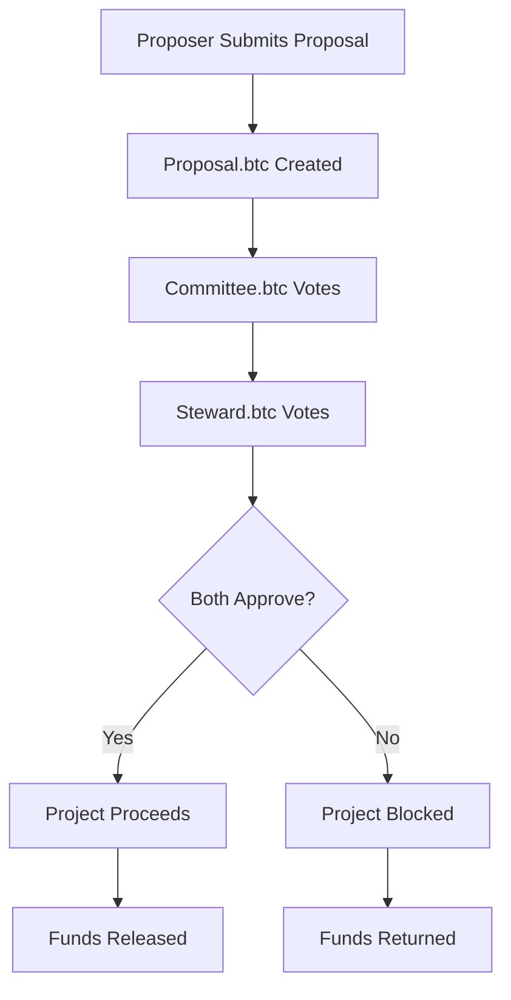

# Fiscal Policy 3.0: Decentralized Proposal Management System

A blockchain-based governance system for managing project proposals with dual-approval mechanisms and transparent fund tracking.

## 🚀 Quickstart for Developers

### Prerequisites
- Python 3.8+
- pip (Python package manager)

### Installation & Setup

1. **Clone the repository**
   ```bash
   git clone https://github.com/exponentlabshq/fiscal-policy-3.0.git
   cd fiscal-policy-3.0
   ```

2. **Install dependencies**
   ```bash
   pip install -r requirements.txt
   ```

3. **Start the Flask application**
   ```bash
   python3 app.py
   ```
   
   The API will be available at `http://localhost:9999`

### 🧪 Testing the API

#### Manual Testing
1. **Open your browser** and navigate to `http://localhost:9999`
2. **Submit a test proposal** using the form
3. **View submitted proposals** at `http://localhost:9999/proposals`

#### Automated Testing
Run the comprehensive test suite:
```bash
python3 test_templates.py  # Validates HTML templates
python3 test_api.py        # Tests actual API functionality
```

### 📁 Project Structure
```
fiscal-policy-3.0/
├── app.py                 # Flask application (main API)
├── requirements.txt       # Python dependencies
├── test_templates.py     # Template validation tests
├── test_api.py          # API functionality tests
├── templates/            # HTML templates
│   ├── index.html       # Proposal submission form
│   ├── proposal.html    # Success confirmation
│   └── proposals.html   # All proposals listing
└── readme.md            # This file
```

## 🏗️ Architecture Overview

This system implements an "Event of events" architecture where multiple entities interact to evaluate, approve, and monitor project proposals.

### Core Entities

- **🚀 Proposer.btc**: Submits project proposals for funding consideration
- **📋 Proposal.btc**: Represents individual project proposals and holds associated funds
- **🏛️ Committee.btc**: Primary governance entity for proposal evaluation
- **🛡️ Steward.btc**: Secondary governance entity for additional oversight

### Data Flow



## 📋 API Endpoints

| Endpoint | Method | Description |
|----------|--------|-------------|
| `/` | GET | Proposal submission form |
| `/submit` | POST | Submit new proposal |
| `/proposals` | GET | List all submitted proposals |

## 🔧 Development

### Adding New Features
1. **Modify `app.py`** for new routes and logic
2. **Update templates** in the `templates/` directory
3. **Add tests** to `test_api.py` for new functionality
4. **Update requirements.txt** for new dependencies

### Testing
- **Template Tests**: `python3 test_templates.py`
- **API Tests**: `python3 test_api.py`
- **Manual Testing**: Use the web interface at `http://localhost:9999`

### Deployment
- **Development**: `python3 app.py` (includes auto-reload)
- **Production**: Use WSGI server (Gunicorn, uWSGI)

## 📊 Current Status

✅ **Proposer.btc API**: Fully functional with form submission, data storage, and listing  
✅ **HTMX Integration**: Smooth form submission without page refresh  
✅ **Template System**: All three templates working correctly  
✅ **Data Persistence**: In-memory storage (ready for database integration)  
✅ **Testing Suite**: Comprehensive validation of all components  

## 🔮 Next Steps

- [ ] Integrate database (SQLite/PostgreSQL) for persistent storage
- [ ] Implement Committee.btc voting interface
- [ ] Implement Steward.btc voting interface
- [ ] Add fund tracking and North Star metrics
- [ ] Deploy to production environment

## 🤝 Contributing

1. Fork the repository
2. Create a feature branch
3. Make your changes
4. Add tests for new functionality
5. Submit a pull request

## 📝 License

This project is part of the Fiscal Policy 3.0 initiative for decentralized governance and transparent fund allocation.

---

## 📚 Original System Specification

### The Actual Entities in this Event of events are the following:
- **Proposer.btc**: The Proposer submits proposals
- **Proposal.btc**: Each proposal submitted by a proposer.btc has a proposal.btc
- **Committee.btc**: The Committee.btc makes a decision on a proposal: Yes or No
- **Steward.btc**: The Steward.btc makes a decision on a proposal: Yes or No
- **Submission (json payload)**: Every proposer.btc submits a submission containing:
  - Timestamp
  - Title
  - Subtitle
  - Description
  - Problem Worth Solving
  - Github
  - YouTube Demo Video
  - Email Address
  - Website
  - ETA
  - Investment Required

### Governance Flow
A proposer represented by proposer.btc proposes a proposal represented by proposal.btc. The success of the proposal is judged by the growth of proposal.btc account which holds the funds generated by the proposer.btc related to their proposal. After the proposer.btc submits their proposal, the Committee and the Steward vote. The Committee.btc votes yes or no. The Steward.btc votes yes or no.

### Proposal.btc
Proposal.btc holds the funds associated with the success of proposer.btc's project. It allows anyone to view the progress of the proposal using the north star metric.